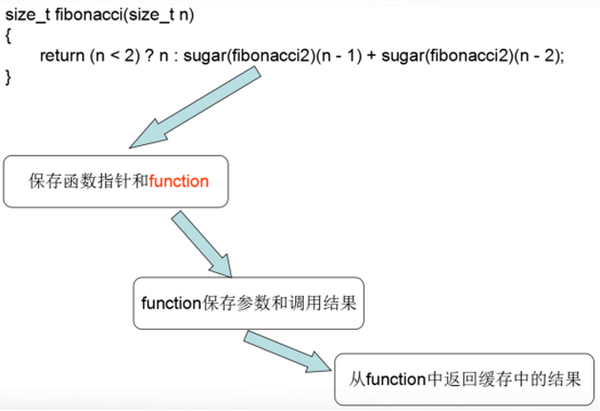
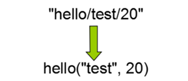

# 06_C++11之美

C++11/14相比以往的C++98/03在很多方面做了简化和增强，尤其是在泛型编程方面，让C++的泛型编程的威力变得更加强大，本文将用三个案例来介绍C++11相比C++98/03如何以一种更灵活、更简洁和更泛化的方式去解决问题。

## 检查成员函数是否存在

有这样一个场景，需要判断某个类型是否存在成员函数foo，如果存在就调用这个成员函数，否则就执行默认的函数，下面是伪代码。
```cpp
template<typename T>  
void foo(const T& t)  
{  
    if (t has foo)  
        t.foo();  
    else  
        default();  
}  
```

在有反射的语言里，如c#和java里，这是很容易的，然而C++没有反射，C++98/03中要实现这个逻辑，需要借助SFINAE（substitution is not an error）特性。实现这个逻辑分为两步，第一步在编译期检查成员函数foo是否存在，第二步根据第一步的检查结果来选择分支。C++98/03里的做法是这样的。
```cpp
template<typename T>  
struct has_member_foo  
{  
    template<typename U, void(U::*)()> struct SFINAE {};  
  
    template<typename U> static char check(SFINAE<U, &U::foo>*);  
    template<typename U> static int check(...);  
  
    static const bool value = sizeof(check<T>(0)) == sizeof(char);  
};  
```

元函数`has_member_foo`中定义了一个辅助结构体SFINAE和重载函数check，辅助结构体在模板实例化的时候可以确定类型U是否存在fooh函数；check重载函数利用了SFINAE（substitution is not an error）特性，编译器会根据重载决议选择最合适的函数，当辅助结构体实例化成功时，第一个check函数的优先级更高，如果实例化失败则会选择优先级最低的check(...)函数，这两个重载函数的返回类型不相同，我们根据函数返回类型的size就可知道类里是否存在成员函数foo了。下面是测试代码。
```cpp
struct MyStruct  
{  
    void foo() {  }  
};  
static_assert(has_member_foo<MyStruct>::value, "true"); //断言通过  
static_assert(has_member_foo<int>::value, "false");  //断言错误  
```

C++11的实现方式是这样的。
```cpp
template<typename T>  
struct has_member_foo11  
{  
private:  
     template<typename U> static auto check(int) ->                  
     decltype(std::declval<U>().foo(), std::true_type());  
  
    template<typename U> static std::false_type check(...);  
public:  
    enum { value = std::is_same<decltype(check<T>(0)),       
    std::true_type>::value };  
};  
```

C++11的实现不需要辅助结构体，用到了几个C++11的新特性：auot、decltype、返回类型后置、declval和trype_traits。具体的实现原理是这样的：通过返回类型后置来推断表达式的类型，推断的过程中利用declval，它可以获取类型的右值引用，以便来调用成员函数，这个过程是在编译期完成的。如果通过declval调用成员函数成功了，则会继续推断逗号表达式的类型，最终推断的函数返回类型为std::true_type；如果通过declval调用成员函数失败了则推断失败，编译器会选择优先级最低的check(...)函数，它的返回类型为std::false_type。我们最后根据返回类型既可知道类型是否存在foo函数。

虽然C++98/03和C++11两种写法都可以推断出是否存在成员函数foo，但是当情况稍微发生一点变化时，就会出现一个问题，比如下面的代码。
```cpp
struct MyStruct  
{  
    int foo() {  }  
};  
static_assert(has_member_foo<MyStruct>::value, "false"); //断言错误  
static_assert(has_member_foo11<MyStruct>::value, "true");  
```

当我们把foo的返回类型修改为int时，C++98/03版本的元函数就推断不出来，原因是因为我们定义辅助结构体时限定了函数签名template struct SFINAE {}，这个只能实例化void()类型的函数，对于返回类型为int的函数就无能为力了。但是对于C++11版本的元函数来说没有问题，因为C++11没有限定返回类型，declval不关心函数返回类型，它只是在编译期调用了成员函数。从这里可以看到C++11的实现方式更灵活，但是这个实现还不够通用，因为它只能推断不含参数的foo，如果存在含参的重载函数foo，该如何处理呢？这个问题对于C++98/03来说几乎是无法解决的一个问题，但对于C++11来说是很轻松的一件事情，通过C++11的新特性--可变模版参数即可解决。下面是通用版本的实现。
```cpp
template<typename T, typename... Args>  
struct has_member_foo11  
{  
private:  
       template<typename U> static auto check(int) -> decltype(std::declval<U>().foo(std::declval<Args>()...), std::true_type());  
  
       template<typename U> static std::false_type check(...);  
public:  
       enum { value = std::is_same<decltype(check<T>(0)), std::true_type>::value };  
};  
```

测试代码：
```cpp
struct MyStruct  
{  
    string foo() { return ""; }  
    int foo(int i) { return i; }  
};  
  
static_assert(has_member_foo<MyStruct>::value, "true");  
static_assert(has_member_foo<MyStruct, int>::value, "true");  
```

虽然我们借助可变模版参数解决了重载函数的问题，但还有一个不足之处，它只能检查函数名为foo的类，如果需要检查其它函数名的类，则需要再定义一个几乎相同的类，这样做繁琐而低效。重复定义的问题我们可以借助宏来解决。下面是实现代码。
```cpp
#define HAS_MEMBER(member)\  
template<typename T, typename... Args>struct has_member_##member\  
{\  
    private:\  
        template<typename U> static auto Check(int) -> decltype(std::declval<U>().member(std::declval<Args>()...), std::true_type());\  
        template<typename U> static std::false_type Check(...);\  
    public:\  
        enum{value = std::is_same<decltype(Check<T>(0)), std::true_type>::value};\  
};  
```
这样每次需要检查不同函数名的时候只需要定义一个简单的宏即可，比如我们需要检查foo和func函数时，可以这样定义。
```cpp
HAS_MEMBER(foo)  
HAS_MEMBER(func)  
```

测试代码：
```cpp
struct MyStruct  
{  
    string foo() { return ""; }  
    int func(int i) { return i; }  
};  
  
static_assert(has_member_foo<MyStruct>::value, "true");  
static_assert(has_member_func<MyStruct, int>::value, "true");  
```

借助C++11的新特性我们完美地解决了检查成员函数是否存在的问题，再回头来看文章开始提出的问题，我们实现了解决问题的第一步，第二步需要在第一步判断的基础上选择分支。同样借助C++11中的type_traits来实现编译期选择分支，具体是通过enable_if来实现的。
```cpp
template<typename T>  
typename std::enable_if<has_member_foo11<T, int>::value>::type testfun(T t) {  
                cout << "has foo" << endl;  
}  
  
template<typename T>  
typename std::enable_if<!has_member_foo11<T, int>::value>::type testfun(T t) {  
            cout << "has no foo" << endl;  
}  
```

最终我们借助C++11完美地解决了编译期检查成员函数是否存在并且在编译期选择分支的问题，实现方式相比C++98/03更加简洁、灵活和通用。

## 函数缓存

为了优化程序性能我们经常使用缓存，比如某个函数非常耗时，频繁调用的时候性能会很低，这时我们就可以通过缓存来提高性能。先看看下面的代码。
```cpp
size_t fibonacci(size_t n)  
{  
    return (n < 2) ? n : fibonacci(n - 1) + fibonacci(n - 2);  
}  
   
void test()  
{  
    Timer t;  
    size_t n = fibonacci(45);  
    cout << n << " " << t.elapsed() << endl;  
}  
```

这个代码在普通双核笔记本上耗时8秒多，这个函数刚好可以通过缓存来优化。
```cpp
size_t fibonacci(size_t n)  
{  
     return (n < 2) ? n : sugar(fibonacci2)(n - 1) + sugar(fibonacci2)(n - 2);  
}  
```

优化之后的fibonacci相比之前的fibonacci2仅仅是多了一个sugar，然而性能却可以提高数十倍，因为sugar内部做了缓存，下面来看看sugar的具体实现。
```cpp
template <typename R, typename...  Args>  
std::function<R(Args...)> sugar(R(*func)(Args...), bool needClear = false)  
{  
     using function_type = std::function<R(Args...)>;  
     static std::unordered_map<decltype(func), function_type> functor_map;  
  
     if (needClear)  
     return functor_map[func] = cache(func);  
  
     if (functor_map.find(func) == functor_map.end())  
         functor_map[func] = cache(func);  
  
     return functor_map[func];  
}  
```

sugar函数内部有一个map（注意，这里用的静态局部变量，C++11中的静态局部变量是线程安全的），用来保存被缓存函数的函数指针和一个std::function，std::function又是从cache函数返回出来的，接下来看看cache的实现。
```cpp
template <typename R, typename... Args>  
std::function<R(Args...)> cache(R(*func) (Args...))  
{  
auto result_map = std::make_shared<std::map<std::tuple<Args...>, R>>();  
  
return ([=](Args... args){  
std::tuple<Args...> t(args...);  
if (result_map->find(t) == result_map->end())  
(*result_map)[t] = func(args...);  
  
return (*result_map)[t];  
});  
}  
```

cache内部有一个map，它保存了被缓存函数调用时的入参和函数的执行结果。cache函数还定义了一个lambda表达式，用于延迟执行，在外面调用function时才执行。Lambda内部的逻辑很简单就是保存调用时的参数和执行结果，当下次调用时会先检查调用的参数是否已经存在，如果已经存在则从缓存map中返回，如果不存在才调用被缓存的函数，同时保存新的调用参数和调用结果。图1是fibonacci函数缓存的过程。

图1 fibonacci函数缓存的过程


C++11实现的这个函数缓存相比传统的缓存方法来说有下面几个优点：

1．相比传统的缓存实现方式，它更通用，可以适应任何函数，无需为每一个被缓存函数定义专门的缓存对象。  
2．更简洁，只需要一个sugar既可以实现缓存。

## 实现一个http router

http router是web服务器的一个核心模块，它会解析url，然后路由到正确的handler上，下面是cinatra框架（一个现代C++写的web framework）的用法。
```cpp
Cinatra app;  
app.route("/hello", [](Request&  req , Response& res)  
{  
      res.end("Hello ");      
});  
  
app.route("/hello/:name/:age", [](Request& req, Response& res,   
    const std::string& a, int b)  
{  
     res.end("Name: " + a + ", Age: " + boost::lexical_cast<std::string>(b));  
});  
```

当用户在浏览器中输入http://127.0.0.1/hello时，会路由到第一个handler，当用户输入http://127.0.0.1/hello/test/20时，会路由到第二个handler。Cinatra支持多种方式的请求，比如http://127.0.0.1/hello/test/20这种请求，它是非标准的，但它可以方便用户使用，用户不必通过get参数的方式去请求了，直接将参数放到后面，使用起来很方便。但是这种方式的实现却很困难，实现这种方式的本质是字符串到函数调用的映射，如图2所示。

图2


如果想通过C++98/03来实现几乎是不可能完成的任务，但对于C++11来说却不是难题。

C++11的实现思路如下：

1. 解析url将参数分割，分割之后的字符串放到列表中{"hello", "test", "2"}；  
2. 将列表中的参数转换为function的实参；  
	* 将列表中的参数分别转换为function的实参。  
	* 将转换后的实参一个一个保存到“容器”--tuple中。  
	* 将tuple转换为函数实参。  
3. handler调用。

实现的关键在于如何将分割的字符串一个一个转换为handler的实参，转换之后又如何实现调用。将字符串转换为handler的实参借助了function_traits，它可以获取函数每一个参数的类型，知道这个类型之后我们就可以将字符串转换为对应类型的值了，即函数实参。转换之后还要考虑保存的问题，因为函数实参的类型是不同的，普通的容器是无法保存不同类型的数据的，这里借助tuple来保存类型不同的实参。保存实参之后还需要完成函数调用，这里需要通过可变模版参数和tuple相互转换来实现函数调用。下面来看看实现的关键技术。

### 【字符串转换为对应的函数实参】

通过function_traits来获取函数参数个数和每个参数的类型，获取之后就可以调用boost.lexicast来将字符串转换为对应的参数值了，接下来将转换之后的参数放到tuple中，以备用于在下一步的函数调用。下面是实现的关键代码，完整的代码读者可以参考我github上的代码：https://github.com/kxjhcs/cosmos/blob/master/router.hpp。
```cpp
template<typename Function, size_t N = 0, size_t M = function_traits<Function>::arity>  
struct invoker  
{  
    template<typename Args>  
    static inline void apply(const Function& func, token_parser & parser, Args const & args)  
    {  
        typedef typename function_traits<Function>::template args<N>::type arg_type;  
        router::invoker<Function, N + 1, M>::apply(func, parser,  
            std::tuple_cat(args, std::make_tuple(parser.get<arg_type>())));  
    }  
};  
  
template<typename Function, size_t M>  
struct invoker<Function, M, M>  
{  
    template<typename Args>  
    static inline void apply(const Function& func, token_parser &, Args const & args)  
    {  
        //参数列表已经准备好，可以调用function了  
        call(func, args);  
    }  
};  
```

### 【实现函数调用】

在前面我们已经将字符串转换为实参并保存到tuple中了，接下来我们需要将tuple转换为函数实参列表，这需要通过将tuple转换为可变模版参数，下面是实现的关键代码。
```cpp
template<typename F, int ... Indexes, typename ... Args>  
static void call_helper(F f, IndexTuple<Indexes...>, const std::tuple<Args...>& tup)  
{  
    f(std::get<Indexes>(tup)...);  
}  
  
template<typename F, typename ... Args>  
static void call(F f, const std::tuple<Args...>& tp)  
{  
    call_helper(f, typename MakeIndexes<sizeof... (Args)>::type(), tp);  
}  
```

其中，MakeIndexes生成了一个整形序列，通过这个整形序列就可以将tuple转换为可变模板参数并完成函数调用了。MakeIndexes的具体实现读者可以参考github上的代码，其实在C++14的utility库中已经提供了std::index_sequence和std::make_index_sequence，代码会更加简洁。

C++11实现的http router不仅仅可以用于http服务器端的路由，还可以实现rpc和mvc框架的路由，所以用C++11去做web开发也是完全可以的。

## 总结

本文先通过介绍检查成员函数是否存在，比较了C++98/03和C++11的实现差异，C++11的实现无疑更加简洁和通用，完美地解决了问题，体现了现代C++解决问题的极致之美。接着介绍了如何实现一个通用的函数缓存，仅仅一个泛化的函数既可以实现缓存任意函数，体现了现代C++的简洁之美和泛化之美。最后展示了现代C++在做web开发的时候如何实现灵活的路由，完成了之前C++98/03几乎不可能完成的任务，体现了现代C++的威力，不仅仅是生产力的巨大提升。

现代C++仍然在发展完善当中，除了近年出现的C++11/14，未来的C++17/20标准正在规划制定当中。C++17将引入更多地激动人心的特性，有并行、并发、网络库、协程、modules和concepts等等，这将是C++发展史上的一座里程碑。

现代C++先天的性能优势与后天的效率（现代、快速开发）优势，除了传统的服务端、游戏、安全、嵌入式和音视频等领域外，用来做移动互联网、云平台和大数据分析正当其时。
