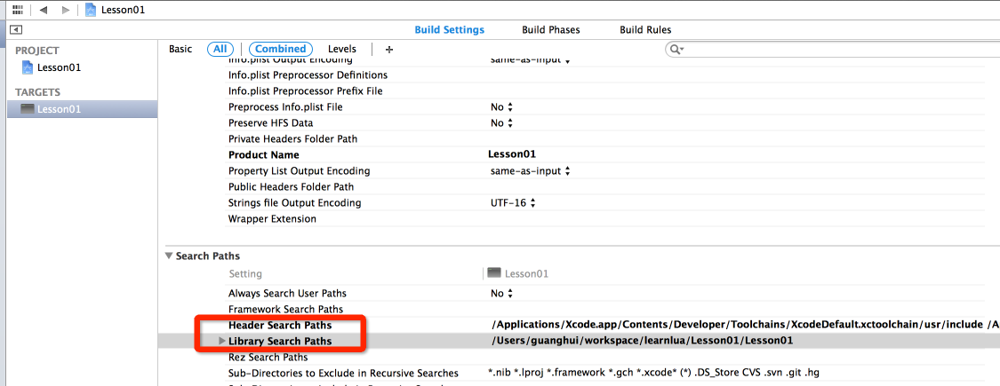
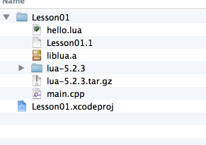
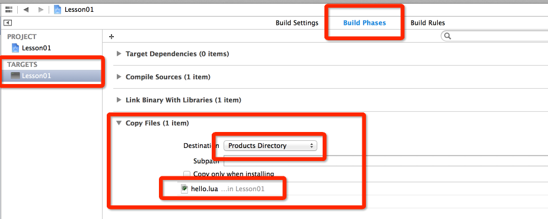

# 01_Lua教程（一）：在C++中嵌入Lua脚本

本系列教程主要介绍如何在C/C++程序里面嵌入Lua脚本，我打算从以下几个方面来介绍：

1. 如何在C/C++里面嵌入Lua脚本
2. Lua访问C/C++数据结构（这里面要介绍类，结构体，函数，变量，枚举等数据类型在lua里面如何访问）
3. C/C++访问Lua的数据，主要是基本数据类型，函数和Table
4. Cocos2D-X里面的Lua绑定（含自动绑定与手动绑定）
5. Cocos2D-x里面Lua和C/C++相互调用
6. Cocos2D-x里面Lua和Java相互调用
7. Cocos2D-x里面Lua和Objective-C相互调用

本系列教程不会过多地介绍Lua的基本语法，关于Lua基本语法的学习，推荐《Programming In Lua》。 如有纰漏，欢迎指出，谢谢。
另外，关于更新时间，每周一篇，定期或者不定期，呵呵。

### Mac项目集成Lua

#### 准备工作

首先，新建一个控制台应用程序。 打开Xcode,New->Project->OSX->Command Line Tool，取名为Lesson01如下图所示：


接下来，我们需要下载lua5.2.3.下载完后，解压缩，然后cd到刚刚解压缩的路径下面，输入make macosx，这样便可以生成Mac下面的lib文件。

接下来把刚刚解压缩的文件夹拷贝到你新建的工程下面，然后设置include路径和library路径。（注意，这里是不需要把头文件添加到Xcode里面的，只要指定include路径，编译的时候，编译器会自动去找的。）


因为我的Lua文件夹的路径是:xxxx/Lesson01/lua-5.2.3，所以，我把search path和library path分别设置为：
```
//search path
$(SRCROOT)/Lesson01/lua-5.2.3/src/
//library path
$(PROJECT_DIR)/Lesson01
```

下面是我的工程与lua之间的目录结构，liblua.a文件是从src里面拷贝出来的。（前面我们使用make macosx生成出来的）


注意：如果直接添加lua的所有源码，则会编译报错。因为lua.c里面也有一个main函数。这个main函数是用来生成可执行程序的。 另外，如果是添加其它第三方的库，也可以参考这个方法，添加search path和library path

#### C++调用Lua文件

首先，打开main.cpp，并包含以下头文件：
```
#include "lua.hpp"
```

如果此时编译不报错，则说明你之前设置的search path是正确的，如果报错，请自行调整search path。

这里面的lua.hpp的内容如下：
```cpp
extern "C" {
#include "lua.h"
#include "lualib.h"
#include "lauxlib.h"
}
```

这才是大多数Lua教程里的代码嘛。然后在main函数里面添加以下内容：
```cpp
//1. 初始化Lua虚拟机
lua_State *lua_state;
lua_state = luaL_newstate();
//2.设置待注册的Lua标准库，这个库是给你的Lua脚本用的
//因为接下来我们只想在Lua脚本里面输出hello world，所以只引入基本库就可以了
static const luaL_Reg lualibs[] =
{
    { "base", luaopen_base },
    { NULL, NULL}
};
//3.注册Lua标准库并清空栈
const luaL_Reg *lib = lualibs;
for(; lib->func != NULL; lib++)
{
    luaL_requiref(lua_state, lib->name, lib->func, 1);
    lua_pop(lua_state, 1);
}
//4、运行hello.lua脚本
luaL_dofile(lua_state, "hello.lua");
//5. 关闭Lua虚拟机
lua_close(lua_state);
```

新建Lua文件
选择New->File->Other，然后命名为hello.lua， 以下是hello.lua里面的内容:
```lua
print "Hello World"
```

编译并运行
此时编译并运行，这时可能看不到控制台输出”Hello World”。因为你的Lua脚本没有拷贝到程序里面去，我们需要再设置一下。如下图所示： （注意：subpath要清空，copy only when installing去掉打勾）


这时，编译并运行，你会得到如下结果 ：


### IOS项目集成Lua

IOS项目集成Lua的方式与Mac大同小异，顺便补充一句，Lua本质上是一个c程序，任何平台下面集成相应c库的方法都是适用的。

这里我主要写一些注意事项吧：

1. 我们刚才编译好的macosx库只能给mac程序用，ios需要单独编译（当然，windows和linux也需要再单独编译，编译方法见下载的lua-5.2.3/doc/readme.html）
2. 编译ios可以通过添加一个static library，然后把所有的Lua文件添加到这个Library里面。最后，让主项目依赖这个Library就可以了。
3. 直接使用luaL_dofile(lua_state, “hello.lua”)是行不通的，因为ios项目的资源路径在一个沙盒里。我们必须取得全路径才可以访问到这个hello.lua文件。以cocos2d-x为例，我们可以使用下面的代码获得hello.lua的全路径，然后再传递给Lua虚拟机。
```cpp
  std::string scriptPath = FileUtils::getInstance()->fullPathForFilename("hello.lua");
    int status = luaL_loadfile(lua_state, scriptPath.c_str());
```
	
### Android项目集成Lua

Android集成Lua需要使用Android.mk把Lua打包成一个静态库，然后在项目里面包含这个Lua模块。具体的做法可以参考cocos2d-x。


